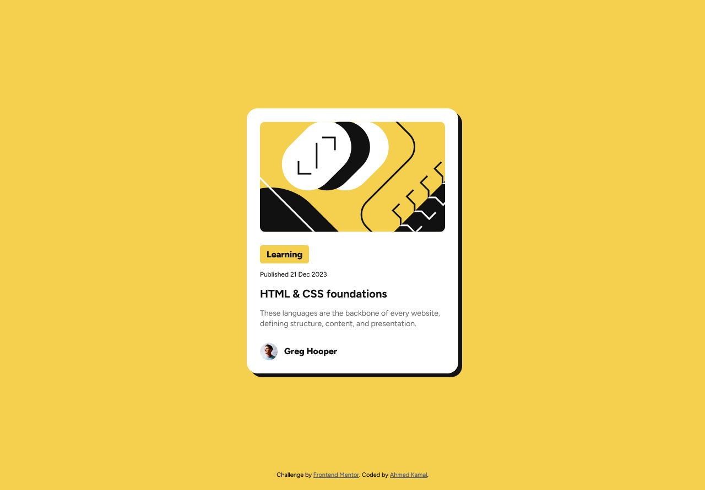

# Frontend Mentor - Blog preview card solution

This is a solution to the [Blog preview card challenge on Frontend Mentor](https://www.frontendmentor.io/challenges/blog-preview-card-ckPaj01IcS). Frontend Mentor challenges help you improve your coding skills by building realistic projects.

## Table of contents

- [Overview](#overview)
  - [Screenshot](#screenshot)
  - [Links](#links)
- [My process](#my-process)
  - [Built with](#built-with)
  - [What I learned](#what-i-learned)
  - [Continued development](#continued-development)
- [Author](#author)
- [Acknowledgments](#acknowledgments)

## Overview

### Screenshot

### Links

## My Process

- Solution URL: https://github.com/aknafea1/Frontend-Mentor-Challenges/blob/main/Blog%20Preview%20Card/
- Live Site URL: https://aknafea1.github.io/Frontend-Mentor-Challenges/Blog%20Preview%20Card

### Built with

- Semantic HTML5 markup
- CSS custom properties
- CSS Flex
- Mobile-first workflow

## Author

- Frontend Mentor - (https://www.frontendmentor.io/profile/aknafea1)
