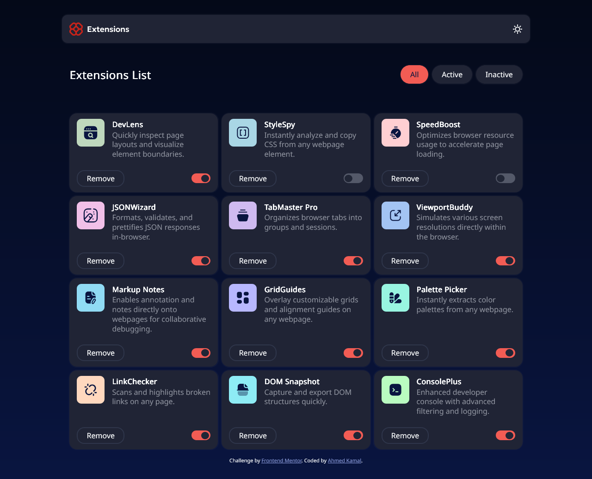
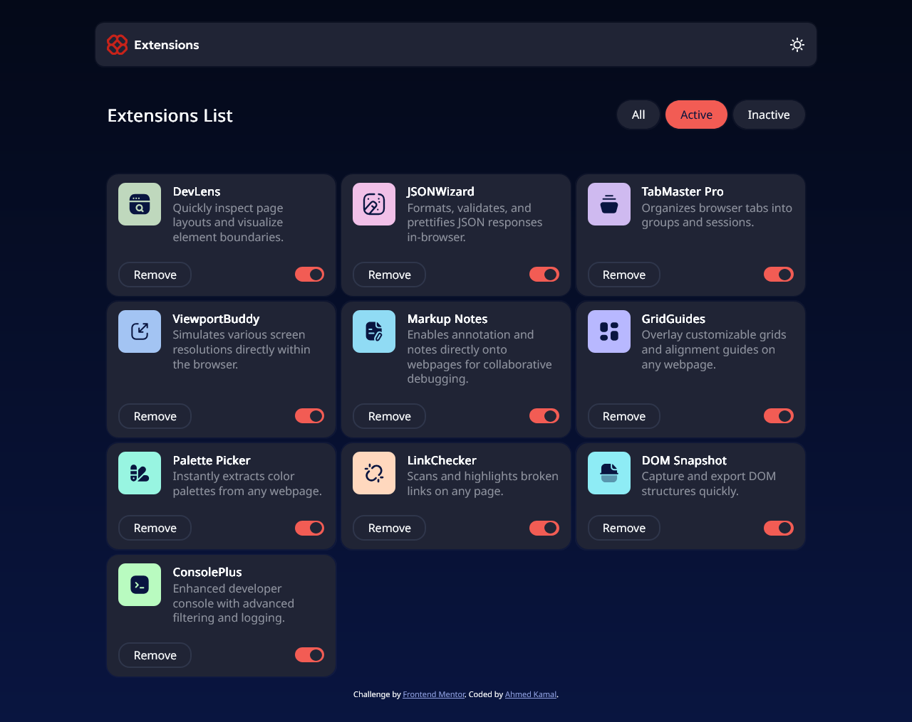
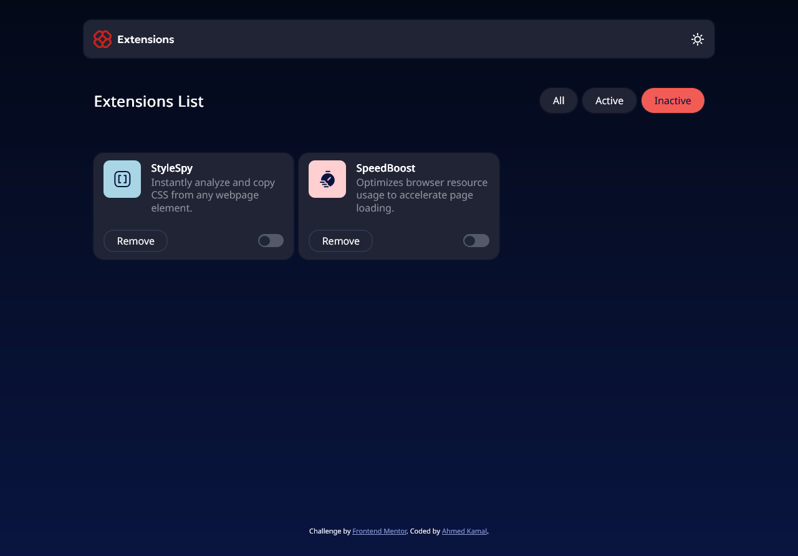
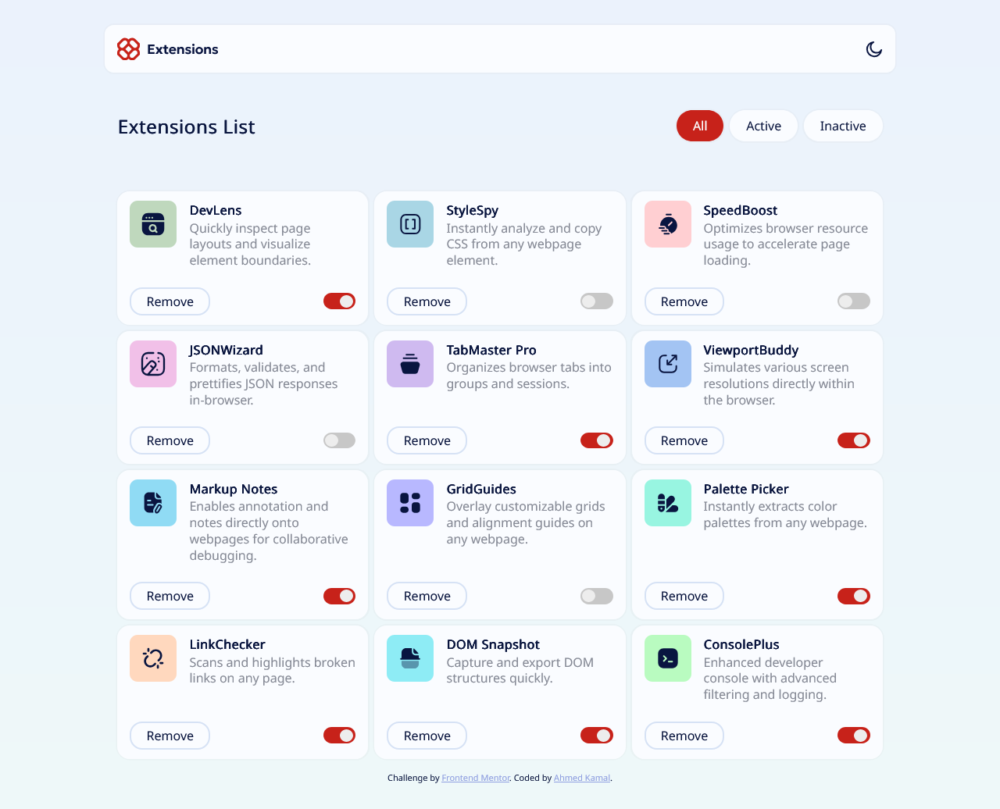
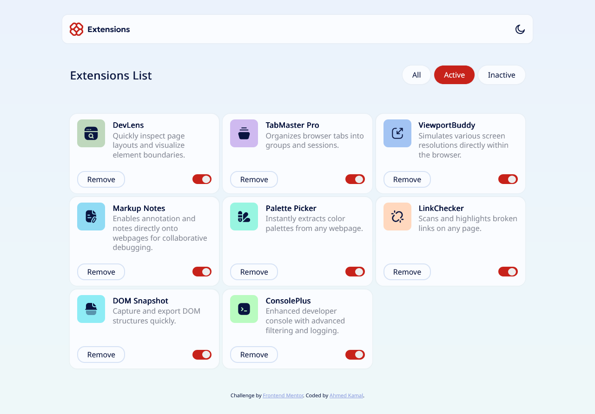
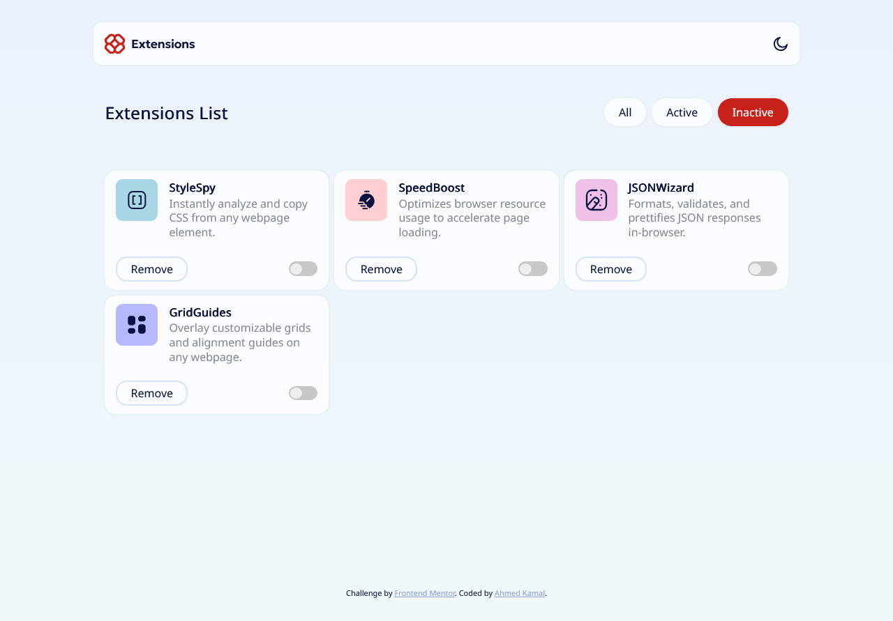

# Frontend Mentor - Browser extensions manager UI solution

This is a solution to the [Browser extensions manager UI challenge on Frontend Mentor](https://www.frontendmentor.io/challenges/browser-extension-manager-ui-yNZnOfsMAp). Frontend Mentor challenges help you improve your coding skills by building realistic projects.

## Table of contents

- [Overview](#overview)
  - [Screenshot](#screenshot)
  - [Links](#links)
- [My process](#my-process)
  - [Built with](#built-with)
  - [What I learned](#what-i-learned)
  - [Continued development](#continued-development)
- [Author](#author)
- [Acknowledgments](#acknowledgments)

## Overview

### Screenshot

### Links

## My Process

- Solution URL: https://github.com/aknafea1/Frontend-Mentor-Challenges/tree/main/Browser%20Extensions%20Manager
- Live Site URL: https://aknafea1.github.io/Frontend-Mentor-Challenges/Browser%20Extensions%20Manager

### Built with

- Semantic HTML5 markup
- CSS custom properties
- CSS Flex
- Css Grid
- Mobile-first workflow
- Vanilla js
- Regex

## Author

- Frontend Mentor - (https://www.frontendmentor.io/profile/aknafea1)
