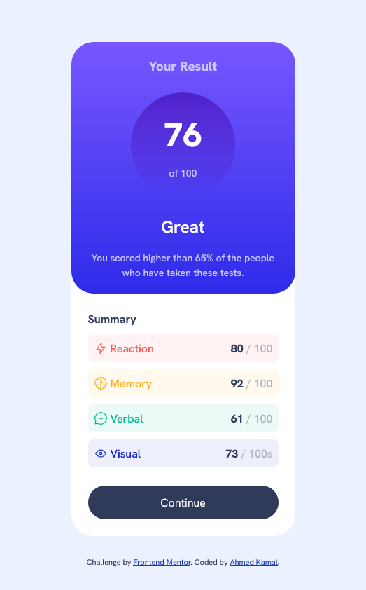

# Frontend Mentor - Results summary component solution

This is a solution to the [Results summary component challenge on Frontend Mentor](https://www.frontendmentor.io/challenges/results-summary-component-CE_K6s0maV). Frontend Mentor challenges help you improve your coding skills by building realistic projects.

## Table of contents

- [Overview](#overview)
  - [Screenshot](#screenshot)
  - [Links](#links)
- [My process](#my-process)
  - [Built with](#built-with)
- [Author](#author)

## Overview

### Screenshot

### Links

## My Process

- Solution URL: https://github.com/aknafea1/Frontend-Mentor-Challenges/blob/main/Result%20Summary%20Components
- Live Site URL: https://aknafea1.github.io/Frontend-Mentor-Challenges/Result%20Summary%20Components

### Built with

- Semantic HTML5 markup
- CSS custom properties
- CSS Flex
- Mobile-first workflow

## Author

- Frontend Mentor - (https://www.frontendmentor.io/profile/aknafea1)
